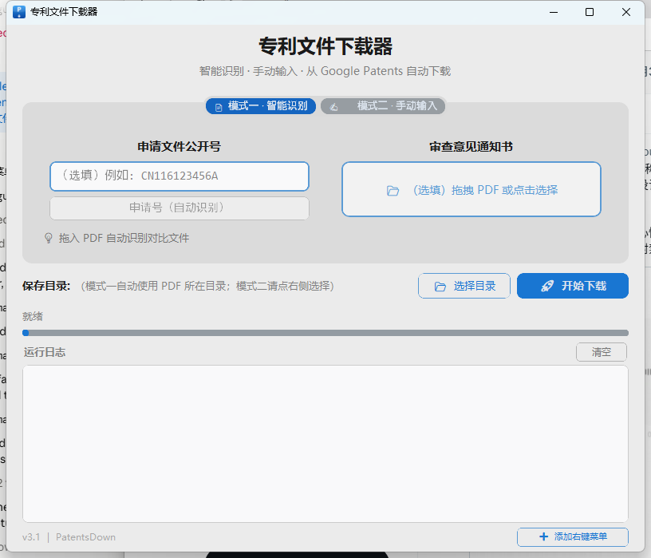
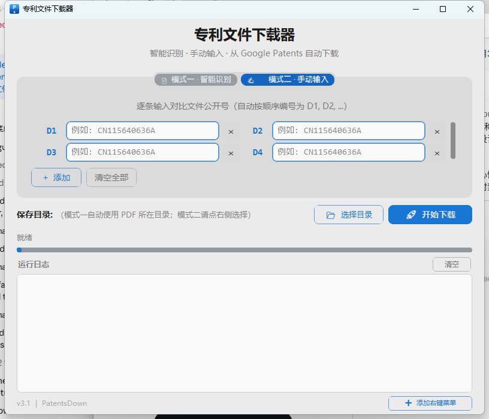

# 🚀 专利文件下载器 (PatentsDown) v3.0

一款**零门槛即用**的 Windows 桌面工具，帮助专利代理人 / 审查员从 **审查意见通知书 PDF** 中自动提取对比文件专利号，或**手动输入公开号**，从 [Google Patents](https://patents.google.com/) 批量下载全文 PDF。

> 工具不上传任何 PDF 内容，不调用云端 AI 接口，所有操作均在本地完成，保护商业隐私。

---

## ✨ v3.0 新特性

- 🆕 **双模式标签页**：智能识别 PDF 与手动输入公开号两种工作流彻底分开，互不干扰。
- 🆕 **模式二 · 手动输入**：动态行 + 2 列网格布局，默认 4 个输入框，可一键增删；输入若干公开号即可批量下载。
- 🎨 **现代化 GUI 全面重做**：基于 `customtkinter` 重构布局，新图标、统一蓝色主题、紧凑面板、明暗模式自适应。
- 📐 **紧凑布局**：默认窗口 800×660，更贴合主流笔记本屏幕；切换标签页时下方控件位置固定不抖动。
- 🆕 **下载按钮归位**：[🚀 开始下载] 与 [📂 选择目录] 同行排列，节省纵向空间。
- 🆕 **新图标**：蓝色渐变背景 + 白色 `P` 字母 + 向下箭头，标题栏、任务栏、EXE 三处统一。

---

## 🖼️ 界面预览

### 模式一 · 智能识别（拖入审查意见 PDF）



### 模式二 · 手动输入（逐条录入公开号）



---

## ✨ 核心功能

| 功能           | 说明                                                   |
| ------------ | ---------------------------------------------------- |
| 📄 **智能解析**  | 自动识别审查意见通知书首页中的申请号与全部对比文件专利号                         |
| ✍️ **手动录入**  | 在模式二中逐条输入公开号，2 列网格布局，自动按顺序编号 D1, D2, ...             |
| 🌐 **全球覆盖**  | 支持 CN、US、WO、EP、JP、KR、DE、FR、GB、TW、AU 等主流国家/地区         |
| ⚡ **双引擎下载** | 优先使用 `requests` 直连（免浏览器极速），失败后自动回退到 `Selenium` 浏览器模式 |
| ⏭️ **增量下载**  | 自动跳过本地已存在且完整的 PDF，避免重复下载                             |
| 🔍 **文件校验**  | 下载完成后自动检查文件大小，< 50KB 则警告可能损坏或被拦截                     |
| 🛡️ **反爬对抗** | 集成 `undetected-chromedriver`，显著降低被 Google 验证码拦截的概率   |
| 📋 **失败清单**  | 任务结束后自动汇总失败专利号，方便一键复制手动处理                            |
| 🆔 **申请号识别** | 拖入 PDF 后自动识别申请号并在界面显示，点击即可复制                         |

---

## 📦 快速开始

### 前置条件

- **Windows 10 / 11**（EXE 方式）或 **Python 3.10+**（源码方式）
- **Google Chrome 浏览器**（仅 Selenium 回退模式需要，首次运行自动下载 ChromeDriver）
- 能正常访问 `patents.google.com`

### 方式一：下载 EXE（推荐，免安装）

直接下载 [PatentsDown_v3.0.exe](https://github.com/vvangpc/PatentsDown/releases/download/v3.0/PatentsDown_v3.0.exe)（46 MB），双击即可运行，无需安装 Python 环境。也可前往 [Releases](https://github.com/vvangpc/PatentsDown/releases/latest) 页面查看历史版本。

### 方式二：使用 uv（开发者推荐）

[uv](https://github.com/astral-sh/uv) 会根据 `pyproject.toml` / `uv.lock` 自动管理虚拟环境与依赖：

```bash
git clone https://github.com/vvangpc/PatentsDown.git
cd PatentsDown
uv run python main.py
```

### 方式三：使用 pip

```bash
git clone https://github.com/vvangpc/PatentsDown.git
cd PatentsDown

python -m venv .venv
.\.venv\Scripts\activate          # Windows PowerShell
# source .venv/bin/activate       # macOS / Linux

pip install customtkinter tkinterdnd2 pymupdf requests undetected-chromedriver webdriver-manager certifi pillow setuptools
python main.py
```

---

## 📝 使用说明

### 模式一 · 智能识别

适合**已收到审查意见通知书 PDF**的场景。

1. 切到「📄 模式一 · 智能识别」标签页。
2. 拖入 PDF 到右侧拖拽区（或点击该区域选择文件）。
3. 工具自动识别申请号（点击可复制）与对比文件 D1/D2/…
4. （可选）左侧输入框填入申请文件公开号一并下载。
5. 点击 [🚀 开始下载] → 文件下载到 PDF 同目录（可通过 [📂 选择目录] 改）。

### 模式二 · 手动输入

适合**只有一组公开号**、不需要 PDF 解析的场景。

1. 切到「✍️ 模式二 · 手动输入」标签页。
2. 在 D1/D2/D3/D4 输入框逐个填写公开号（如 `CN115640636A`）。
3. 不够 4 个？空着无所谓；多于 4 个？点 [+ 添加] 增加新行。
4. 想清空全部？点 [清空全部]；想删除某一行？点该行末尾的 ✕。
5. 通过 [📂 选择目录] 指定保存路径，再点击 [🚀 开始下载]。

### 通用规则

- **文件命名**：下载后的 PDF 命名为 `<标签>-<公开号>.pdf`，如 `D1-CN115640636A.pdf`、`申请文件-CN116123456A.pdf`。
- **增量下载**：再次运行同一任务时，工具会自动跳过已存在且大小 >50KB 的 PDF。
- **失败处理**：任务结束后日志底部会列出失败专利号，复制后到 [Google Patents](https://patents.google.com/) 手动搜索下载。

---

## 🏗️ 项目结构

```
PatentsDown/
├── main.py             # GUI 入口（customtkinter + tkinterdnd2，双标签页布局）
├── downloader.py       # 下载引擎（requests 直连 + Selenium 回退）
├── extractor.py        # PDF 解析（PyMuPDF 提取文本 + 正则匹配专利号）
├── icon.ico            # 应用图标（多尺寸 ICO）
├── PatentsDown.spec    # PyInstaller 打包配置
├── pyproject.toml      # 项目元数据与依赖（uv 兼容）
├── uv.lock             # 依赖锁定文件
├── scripts/
│   └── make_icon.py    # 图标生成脚本（Pillow）
├── docs/
│   ├── screenshot_mode1.png
│   └── screenshot_mode2.png
└── README.md
```

---

## 🛠️ 技术栈

| 组件                        | 用途                 |
| ------------------------- | ------------------ |
| `customtkinter`           | 现代化桌面 GUI（明暗模式自适应） |
| `tkinterdnd2`             | 文件拖拽支持             |
| `PyMuPDF` (fitz)          | PDF 文本提取           |
| `requests`                | HTTP 直连下载（极速模式）    |
| `undetected-chromedriver` | 反爬浏览器驱动（回退模式）      |
| `webdriver-manager`       | ChromeDriver 自动管理  |
| `Pillow`                  | 图标生成（开发时）          |
| `PyInstaller`             | 打包为独立 EXE          |

---

## 🔧 打包为 EXE

```bash
# 在已安装 PyInstaller 的环境中执行
pyinstaller PatentsDown.spec --noconfirm --clean

# 或使用 uv
uv run pyinstaller PatentsDown.spec --noconfirm --clean
```

生成的 EXE 位于 `dist/专利文件下载器_v3.0.exe`（Release 页面以 ASCII 文件名 `PatentsDown_v3.0.exe` 上传），单文件可独立运行。

---

## 📜 更新日志

### v3.0（本次发布）

- 双模式标签页：智能识别 / 手动输入分开为独立 Tab。
- 模式二全新 — 2 列网格输入、动态行增删、按行优先重排。
- 全新现代化 GUI：新蓝色主题图标、紧凑布局、字号统一可读、明暗模式自适应。
- 下载按钮归位到「保存目录」同行，节省纵向版面。
- 窗口默认尺寸 800×660，比 v2.x 更适合笔记本屏幕。
- 应用统一更名为「专利文件下载器」。

### v2.x

- v2.2: 桌面图标支持、申请号自动识别与显示。
- v2.1: 完整 GUI 线程安全、国家/地区扩展（DE、FR、GB、TW、AU）。
- v2.0: 反爬升级（undetected-chromedriver）、文件大小校验、自动跳过已存在文件、失败列表汇总。

---

## ⚠️ 注意事项

- **网络要求** — 需能正常访问 Google Patents（部分网络环境可能需要代理）。
- **Chrome 浏览器** — Selenium 回退模式需要本地安装 Chrome；首次使用时会自动下载 ChromeDriver。
- **频繁访问限制** — 大批量下载时 Google 可能触发验证码，建议适当间隔或分批处理。
- **扫描件 PDF** — 工具仅支持文字型 PDF，扫描件（图片型）无法自动提取对比文件号；此时建议改用模式二手动输入。

---

## 📄 许可证

[MIT License](LICENSE)
