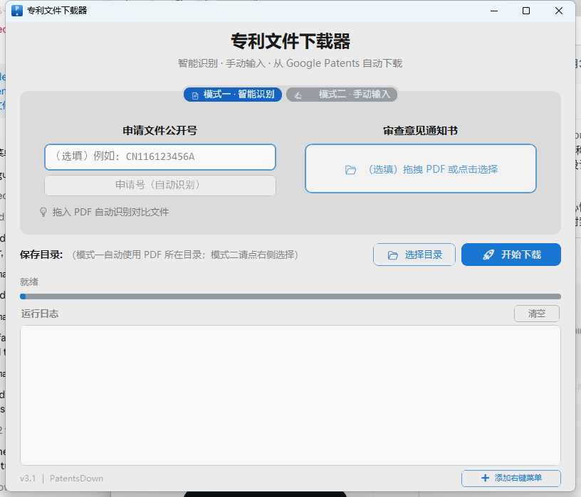
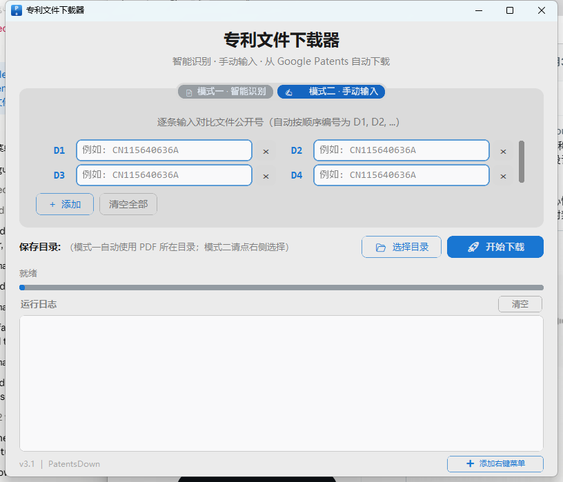

# 🚀 专利文件下载器 (PatentsDown) v3.6.1

一款**零门槛即用**的 Windows 桌面工具，帮助专利代理人 / 审查员从 **审查意见通知书 PDF** 中自动提取对比文件专利号，或**手动输入公开号**，从 [Google Patents](https://patents.google.com/) 批量下载全文 PDF。

> 工具不上传任何 PDF 内容，不调用云端 AI 接口，所有操作均在本地完成，保护商业隐私。

---

## 🔧 v3.6.1 修复

- **修复受限环境（含 VPS）下链路1 直连下载失败** — 直连请求头去掉 `br` 编码声明（未装 brotli 解码库时会拿到乱码 HTML，导致解析不到 PDF 链接）。
- **PDF 真实地址优先解析 `citation_pdf_url`** meta 标签（Google 官方给出的规范地址），正则扫描作兜底。
- **新增 `%PDF` 文件头校验** — 三条下载路径下载后均校验文件头，不是真 PDF（如报错页 / 验证码页）就删除并判失败，不再把坏文件当成功。

---

## ✨ v3.6 新特性

- 🔀 **新增「下载链路」选择** — 底部新增两个互斥复选框：
  - **链路1 · 直连**：保持原行为，本机 `requests` 直连 Google Patents + Selenium 浏览器兜底。
  - **链路2 · VPS 中转**：当本机出口 IP 被 Google 风控（连续 503）时，可把公开号发送到部署在
    **未被风控的 VPS** 上的下载服务，由 VPS 用自己的 IP 下载，再把 PDF 字节回传本机保存。
- ⚙ **链路2 设置弹窗** — 填写 VPS 地址与令牌 Token，可「测试连接」，配置保存到本地
  `%APPDATA%\PatentsDown\link_config.json`（**不进 Git 仓库**，避免暴露自己的 VPS）。
- 📦 **自带 VPS 服务端** — 新增 `vps_server/`（Flask + requests，systemd 托管），整目录拷到 VPS 即可部署，
  详见 [`vps_server/README_DEPLOY.md`](vps_server/README_DEPLOY.md)。两条链路共用「失败清单 / 扫描件检测 / 完成弹窗」。

### 历史特性（保留）

- **扫描件（图片型）PDF 检测**（v3.5）：下载完成后自动检测所有已保存的 PDF，汇总标出无可提取文字层的图片型 PDF，并在日志和完成弹窗中提醒。
- **修复对比文件 D 标号错位**（v3.4）：OA 通知书首页对比文件表中若有非专利文献（如论文），现按 OA「编号」列对齐 D 标号，非专利行跳过下载并在日志中提示。
- **表格结构感知解析**（v3.4）：优先用 PyMuPDF `find_tables()` 读取「编号 / 文件号或名称 / 公开日期」三列，识别失败时回退启发式行分组、再回退全文正则。
- **长路径挤出按钮修复**（v3.3）：「保存目录」行的路径过长时不再把按钮挤出可视区；超长路径以 `C:\Users\...\folder` 形式紧凑显示，悬停看完整路径。
- **下载稳定性提升**（v3.2）：直连模式拟真请求头 + 503/429 指数退避重试；浏览器兜底用标准 Selenium 驱动 Chrome 148+，弹出可见窗口便于手动过验证。
- **安装版 + GitHub Actions 自动构建**（v3.2）：Inno Setup 安装包启动更快；推送 `v*` 标签即触发自动构建发布。
- **Windows 右键菜单集成**（v3.1）：右键任意 PDF → 「专利文件下载」即可启动并自动加载到模式一。
- **CLI 参数支持**（v3.1）：exe 可接受 PDF 路径作为第一个参数。
- **双模式标签页**（v3.0）：智能识别 PDF 与手动输入公开号两种工作流彻底分开。
- **现代化 GUI**（v3.0）：基于 `customtkinter`，蓝色主题、紧凑布局、明暗模式自适应。

---

## 🖼️ 界面预览

### 模式一 · 智能识别（拖入审查意见 PDF）



### 模式二 · 手动输入（逐条录入公开号）



---

## ✨ 核心功能

| 功能           | 说明                                                   |
| ------------ | ---------------------------------------------------- |
| 📄 **智能解析**  | 自动识别审查意见通知书首页中的申请号与全部对比文件专利号                         |
| ✍️ **手动录入**  | 在模式二中逐条输入公开号，2 列网格布局，自动按顺序编号 D1, D2, ...             |
| 🌐 **全球覆盖**  | 支持 CN、US、WO、EP、JP、KR、DE、FR、GB、TW、AU 等主流国家/地区         |
| ⚡ **双引擎下载** | 优先使用 `requests` 直连（免浏览器极速），失败后自动回退到 `Selenium` 浏览器模式 |
| 🔀 **双链路下载** | 链路1 本机直连；链路2 经自建 VPS 中转，绕开本机 IP 被 Google 风控（503）的场景 |
| ⏭️ **增量下载**  | 自动跳过本地已存在且完整的 PDF，避免重复下载                             |
| 🔍 **文件校验**  | 下载完成后自动检查文件大小，< 50KB 则警告可能损坏或被拦截                     |
| 🖼️ **扫描件检测** | 下载后自动标出无文字层的图片型（扫描件）PDF，提醒可改用模式二手动处理                  |
| 🛡️ **反爬对抗** | 直连模式带退避重试；浏览器兜底以可见窗口运行，遇人机验证可手动通过                    |
| 📋 **失败清单**  | 任务结束后自动汇总失败专利号，方便一键复制手动处理                            |
| 🆔 **申请号识别** | 拖入 PDF 后自动识别申请号并在界面显示，点击即可复制                         |

---

## 📦 快速开始

### 前置条件

- **Windows 10 / 11**（EXE 方式）或 **Python 3.10+**（源码方式）
- **Google Chrome 浏览器**（仅 Selenium 回退模式需要，由 Selenium Manager 自动匹配并下载驱动）
- 能正常访问 `patents.google.com`

### 方式一：下载 EXE（推荐）

前往 [Releases](https://github.com/vvangpc/PatentsDown/releases/latest) 页面，根据需要选择：

| 文件 | 说明 |
| --- | --- |
| **[PatentsDown_v3.6.1_Setup.exe](https://github.com/vvangpc/PatentsDown/releases/download/v3.6.1/PatentsDown_v3.6.1_Setup.exe)** | **安装版** — 双击安装到当前用户目录（无需管理员），**启动速度快**，推荐日常使用 |
| **[PatentsDown_v3.6.1_Portable.exe](https://github.com/vvangpc/PatentsDown/releases/download/v3.6.1/PatentsDown_v3.6.1_Portable.exe)** | **便携版** — 单文件免安装、可随身拷贝；首次启动需自解压，略慢 |

均无需安装 Python 环境，开箱即用。

### 方式二：使用 uv（开发者推荐）

[uv](https://github.com/astral-sh/uv) 会根据 `pyproject.toml` / `uv.lock` 自动管理虚拟环境与依赖：

```bash
git clone https://github.com/vvangpc/PatentsDown.git
cd PatentsDown
uv run python main.py
```

### 方式三：使用 pip

```bash
git clone https://github.com/vvangpc/PatentsDown.git
cd PatentsDown

python -m venv .venv
.\.venv\Scripts\activate          # Windows PowerShell
# source .venv/bin/activate       # macOS / Linux

pip install customtkinter tkinterdnd2 pymupdf requests selenium certifi pillow setuptools
python main.py
```

---

## 📝 使用说明

### 模式一 · 智能识别

适合**已收到审查意见通知书 PDF**的场景。

1. 切到「📄 模式一 · 智能识别」标签页。
2. 拖入 PDF 到右侧拖拽区（或点击该区域选择文件）。
3. 工具自动识别申请号（点击可复制）与对比文件 D1/D2/…
4. （可选）左侧输入框填入申请文件公开号一并下载。
5. 点击 [🚀 开始下载] → 文件下载到 PDF 同目录（可通过 [📂 选择目录] 改）。

### 模式二 · 手动输入

适合**只有一组公开号**、不需要 PDF 解析的场景。

1. 切到「✍️ 模式二 · 手动输入」标签页。
2. 在 D1/D2/D3/D4 输入框逐个填写公开号（如 `CN115640636A`）。
3. 不够 4 个？空着无所谓；多于 4 个？点 [+ 添加] 增加新行。
4. 想清空全部？点 [清空全部]；想删除某一行？点该行末尾的 ✕。
5. 通过 [📂 选择目录] 指定保存路径，再点击 [🚀 开始下载]。

### 通用规则

- **文件命名**：下载后的 PDF 命名为 `<标签>-<公开号>.pdf`，如 `D1-CN115640636A.pdf`、`申请文件-CN116123456A.pdf`。
- **增量下载**：再次运行同一任务时，工具会自动跳过已存在且大小 >50KB 的 PDF。
- **失败处理**：直连若被限流会自动转入浏览器兜底；任务结束后日志底部会列出失败专利号，复制后到 [Google Patents](https://patents.google.com/) 手动搜索下载。
- **人机验证**：浏览器兜底遇到 Google 人机验证时会弹出可见窗口，手动完成验证后程序自动继续下载。

### 🔀 下载链路选择（链路1 直连 / 链路2 VPS 中转）

界面底部「添加右键菜单」按钮左侧有两个互斥复选框，默认 **链路1 · 直连**。

- **链路1 · 直连**：本机直接访问 Google Patents（无需任何额外配置）。
- **链路2 · VPS 中转**：当本机出口 IP 被 Google 风控（日志反复出现 503、转浏览器兜底）时使用。
  把公开号发送到你自己部署在**未被风控 VPS** 上的下载服务，由 VPS 代为下载并回传 PDF。

启用链路2 的步骤：

1. 先在一台 IP 未被风控的 VPS 上部署服务端，见 [`vps_server/README_DEPLOY.md`](vps_server/README_DEPLOY.md)。
2. 在 App 中点底部 `⚙` 打开「链路2 设置」，填入 VPS 地址（如 `http://1.2.3.4:8000`）与令牌 Token，
   点「测试连接」通过后保存。配置存于本地 `%APPDATA%\PatentsDown\link_config.json`，**不会进入 Git 仓库**。
3. 勾选「链路2 · VPS」即可。勾选时若尚未配置，会自动弹出设置窗引导填写。

> 安全说明：VPS 地址与 Token 仅保存在本机 `%APPDATA%`，源码与仓库中均不含任何 VPS 凭证；
> 服务端鉴权仅靠 `Authorization: Bearer <Token>`，可在多台电脑上凭同一 Token 使用。

### 🪄 Windows 右键菜单集成

把 PDF 解析一步搞定：

1. 把下载好的 exe（安装版安装后的 `PatentsDown.exe`，或便携版 `PatentsDown_v3.6.1_Portable.exe`）放在一个**稳定的位置**，双击启动。
2. 在 App 右下角点 `[➕ 添加右键菜单]`，看到「已添加」提示后关闭 App。
3. 之后在资源管理器里**右键任意 PDF** → 「专利文件下载」即可启动 App 并自动把该 PDF 加载到模式一，点 [🚀 开始下载] 直接下载。
4. 不需要时在 App 内点 `[✓ 右键菜单已添加（点击移除）]` 即可移除。
5. 若后续移动了 exe，下次启动时 App 会在日志里提示需要重新注册。

**技术细节**：注册位置 `HKCU\Software\Classes\SystemFileAssociations\.pdf\shell\PatentsDown`，仅作用于当前用户、不需要管理员权限。注册项指向当前 exe 的绝对路径与图标。

也可以通过命令行直接传入 PDF 路径达到同样效果：
```powershell
PatentsDown_v3.6.1_Portable.exe "C:\path\to\审查意见.pdf"
```

---

## 🏗️ 项目结构

```
PatentsDown/
├── main.py                 # GUI 入口（customtkinter + tkinterdnd2，双标签页布局）
├── downloader.py           # 下载引擎（链路1：requests 直连 + Selenium 回退）
├── remote_client.py        # 链路2 客户端：把公开号发往 VPS，回收 PDF 字节
├── link_config.py          # 链路2 本地配置读写（%APPDATA%\PatentsDown\link_config.json）
├── extractor.py            # PDF 解析（PyMuPDF 提取文本 + 正则匹配专利号 + 扫描件检测）
├── shell_menu.py           # Windows 右键菜单注册（HKCU winreg）
├── icon.ico                # 应用图标（多尺寸 ICO）
├── PatentsDown.spec        # PyInstaller 单文件(便携版)打包配置
├── PatentsDown-dir.spec    # PyInstaller 目录打包配置（供安装版使用）
├── installer.iss           # Inno Setup 安装包脚本（安装版）
├── pyproject.toml          # 项目元数据与依赖（uv 兼容）
├── uv.lock                 # 依赖锁定文件
├── vps_server/             # 链路2 服务端（拷到 VPS 部署，自包含）
│   ├── server.py           #   Flask 服务：/health、/download（Bearer Token 鉴权）
│   ├── requirements.txt    #   flask / requests
│   ├── patentsdown-server.service  # systemd 单元（开机自启）
│   └── README_DEPLOY.md    #   Ubuntu 24 部署步骤
├── .github/
│   └── workflows/
│       └── build.yml       # GitHub Actions：打 tag 自动构建并发布 Release
├── scripts/
│   └── make_icon.py        # 图标生成脚本（Pillow）
├── docs/
│   ├── screenshot_mode1.png
│   ├── screenshot_mode2.png
│   ├── release_notes_v3.0.md
│   ├── release_notes_v3.1.md
│   ├── release_notes_v3.2.md
│   ├── release_notes_v3.3.md
│   ├── release_notes_v3.4.md
│   ├── release_notes_v3.6.md
│   └── release_notes_v3.6.1.md
└── README.md
```

---

## 🛠️ 技术栈

| 组件                | 用途                 |
| ----------------- | ------------------ |
| `customtkinter`   | 现代化桌面 GUI（明暗模式自适应） |
| `tkinterdnd2`     | 文件拖拽支持             |
| `PyMuPDF` (fitz)  | PDF 文本提取           |
| `requests`        | HTTP 直连下载（极速模式）    |
| `Selenium`        | 浏览器回退驱动（内置 Selenium Manager 自动管理 ChromeDriver） |
| `Flask`           | 链路2 VPS 服务端（仅部署在 VPS，客户端不依赖） |
| `Pillow`          | 图标生成（开发时）          |
| `PyInstaller`     | 打包为 EXE            |
| `Inno Setup`      | 生成安装版安装包           |

---

## 🔧 本地打包

```bash
# 便携版（单文件）
pyinstaller PatentsDown.spec --noconfirm --clean
# → dist/PatentsDown_v3.6.1_Portable.exe

# 安装版：先目录打包，再用 Inno Setup 生成安装包
pyinstaller PatentsDown-dir.spec --noconfirm --clean
ISCC.exe installer.iss
# → dist/PatentsDown_v3.6.1_Setup.exe
```

> 也可直接推送 `v*` 标签，由 GitHub Actions（`.github/workflows/build.yml`）自动完成上述两种构建并发布到 Release。

---

## 📜 更新日志

### v3.6.1（本次发布）

- 修复受限环境（含 VPS）下链路1 直连下载失败 —— 直连请求头去掉 `br` 编码声明，避免未装 brotli 解码库时拿到乱码 HTML、解析不到 PDF 链接。
- PDF 真实地址优先解析 `citation_pdf_url` meta 标签（Google 官方规范地址），正则扫描 patentimages 直链作兜底。
- 链路1 / 链路2 客户端 / VPS 服务端三处下载后均新增 `%PDF` 文件头校验，非真 PDF（报错页 / 验证码页）即删除并判失败，不再把坏文件当成功计数。
- 顺带统一 `pyproject.toml` 版本号（此前滞后于实际发布）。

### v3.6

- 新增「下载链路」选择：底部两个互斥复选框「链路1 · 直连」/「链路2 · VPS 中转」。
- 链路2 让本机 IP 被 Google 风控（503）时，可经未被风控的 VPS 中转下载，再回传 PDF。
- 新增链路2 设置弹窗（VPS 地址 + Token，可测试连接），配置存于本地 `%APPDATA%`，不进 Git 仓库。
- 新增自包含 VPS 服务端 `vps_server/`（Flask + requests + systemd，Bearer Token 鉴权）。

### v3.5

- 新增扫描件（图片型）PDF 检测：下载完成后自动检测所有已保存的 PDF，汇总标出无可提取文字层的图片型 PDF，并在日志和完成弹窗中提醒。

### v3.4

- 修复 OA 通知书对比文件 D 标号错位 — 当首页表格里含非专利文献（论文等）时，D 标号现严格对齐 OA「编号」列，非专利行跳过下载并在日志提示。
- 表格结构感知解析：PyMuPDF `find_tables()` 主路径 + 启发式行分组回退 + 旧版全文正则终极回退（落到终极回退时给出明确警告）。
- `process_office_action` 返回签名扩展为 4-tuple，新增 `skipped_list`，便于上层把跳过的非专利文献写入运行日志。

### v3.3

- 修复「保存目录」长路径把「选择目录 / 开始下载」按钮挤出可视区的 UI bug。
- 路径以中部 `...` 省略显示（如 `C:\Users\Administrator\...\zip_2104`），鼠标悬停可弹出 tooltip 显示完整路径。
- 调整路径行 pack 顺序，按钮在任何窗口宽度下都保持完整可见。

### v3.2

- 修复直连模式 503 反爬失败 — 补全拟真请求头并对 503/429 做指数退避重试。
- 修复浏览器兜底无法启动 — 弃用 `undetected-chromedriver`，改用标准 `Selenium`，支持 Chrome 148+。
- 浏览器兜底改为可见窗口运行，遇人机验证可手动通过。
- 新增安装版（Inno Setup，目录打包），启动速度远快于单文件便携版。
- 新增 GitHub Actions 自动构建与发布流程。

### v3.1

- Windows 资源管理器右键菜单集成 — 右键任意 PDF 即可启动并自动加载到模式一。
- CLI 参数支持 — exe 可接受 PDF 路径作为第一个参数。
- App 内 [➕ 添加 / 移除右键菜单] 一键开关（HKCU 注册，无需管理员）。
- 右键菜单指向旧路径时自动在日志中提示重新注册。

### v3.0

- 双模式标签页：智能识别 / 手动输入分开为独立 Tab。
- 模式二全新 — 2 列网格输入、动态行增删、按行优先重排。
- 全新现代化 GUI：新蓝色主题图标、紧凑布局、字号统一可读、明暗模式自适应。
- 下载按钮归位到「保存目录」同行，节省纵向版面。
- 窗口默认尺寸 800×660，比 v2.x 更适合笔记本屏幕。
- 应用统一更名为「专利文件下载器」。

### v2.x

- v2.2: 桌面图标支持、申请号自动识别与显示。
- v2.1: 完整 GUI 线程安全、国家/地区扩展（DE、FR、GB、TW、AU）。
- v2.0: 反爬升级、文件大小校验、自动跳过已存在文件、失败列表汇总。

---

## ⚠️ 注意事项

- **网络要求** — 需能正常访问 Google Patents（部分网络环境可能需要代理）。若本机 IP 被风控（反复 503），可改用 **链路2 · VPS 中转**（见上文「下载链路选择」）。
- **Chrome 浏览器** — Selenium 回退模式需要本地安装 Chrome；驱动由 Selenium Manager 自动匹配下载。
- **频繁访问限制** — 大批量下载时 Google 可能触发验证码，浏览器兜底会弹出可见窗口供手动通过。
- **扫描件 PDF** — 工具仅支持文字型 PDF，扫描件（图片型）无法自动提取对比文件号；此时建议改用模式二手动输入。

---

## 📄 许可证

[MIT License](LICENSE)
